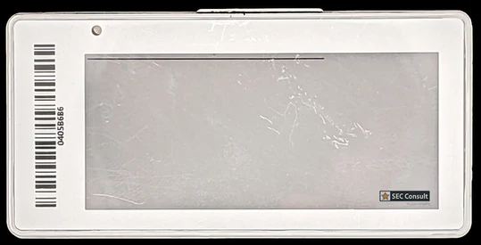

# Suny ESL

This repository contains research conducted at the SEC Consult Vulnerbaility Lab about Electronic Shelf Labels.
The Blogpost can be found [here](https://sec-consult.com/blog/detail/blackmail-roulette-the-risks-of-electronic-shelf-labels-for-retail-and-critical-infrastructure/).
The technical advisory is hosted [here](https://sec-consult.com/vulnerability-lab/advisory/replay-attacks-displaying-arbitrary-contents-in-zhuhai-suny-technology-esl-tag-etag-tech-protocol-electronic-shelf-labels/)

Tl;dr: The proprietary 433MHz protocol used for communication with the tags has no security features. Hence, everyone can read and write to these tags using a SDR.
This project implements a sender and receiver in GNURadio.

## What is affected

Affected are all devices manufactured by Zhuhai Suny Technlology Co Ltd (sometimes also called ETAG-TECH) that use 433MHz communication.

## Install

1. Install the gr-reveng_srb OOT GNURadio module (see [gr-reveng_srb/README.md](gr-reveng_srb/README.md))
2. Install the gr-esl OOT GNURadio module (see [gr-esl/README.md](gr-esl/README.md))
3. Create a venv in the scripts folder and install the requirements `python -m venv venv & source venv/bin/activate & pip install -r requirements.txt`

## Receiving and Decoding Communication

1. Open the `esl-decoder.grc` file in GNURadio Companion
2. Update the Osmocom source to your HackRF ID, or change the block to an input block of your SDR.
3. Execute the `esl_cli.py` script from the `scripts` folder
4. Execute the GNURadio Companion script

## Displaying arbitrary tag contents

1. Open the `esl_sender.grc` file in GNURadio Companion
2. Update the Osmocom source to your HackRF ID, or change the block to an input block of your SDR.
3. Adjust the `img_source` blocks parameters. Make sure it points to your image and andjust the values for the width and height.
4. Execute the GNURadio Companion script

